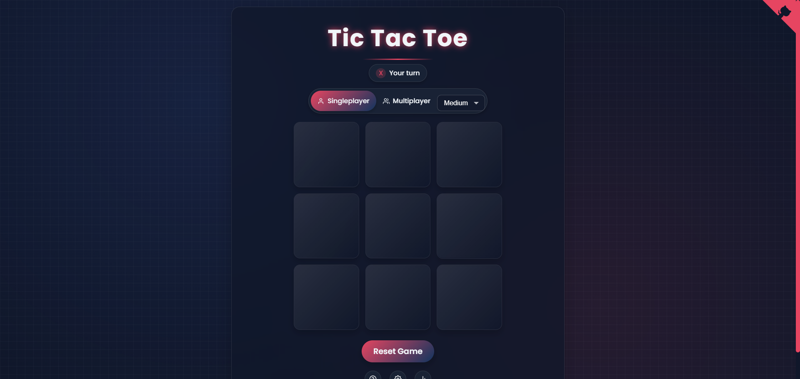

# TicTacAI - Advanced Tic Tac Toe Game

<p align="center">
  
</p>

<p align="center">
  <a href="https://tictacai.codemeapixel.com">Play Online</a> •
  <a href="#features">Features</a> •
  <a href="#ai-characters">AI Characters</a> •
  <a href="#installation">Installation</a> •
  <a href="#how-to-play">How To Play</a> •
  <a href="#technologies">Technologies</a> •
  <a href="#license">License</a>
</p>

## Overview

TicTacAI is not your average Tic Tac Toe game. It features multiple AI characters with unique playing strategies, different difficulty levels, customizable settings, and detailed gameplay statistics. Challenge the computer in singleplayer mode or play against a friend in multiplayer mode.

## Features

- **Multiple Game Modes**: Play against the computer or challenge a friend in local multiplayer
- **AI Characters**: Choose from 4 different AI personalities with unique strategies
- **Difficulty Levels**: Select from Easy, Medium, or Hard computer opponents
- **Customizable Settings**: Personalize player names, toggle sound effects, and more
- **Dark Mode**: Play in comfortable dark theme
- **Responsive Design**: Play on any device - mobile, tablet, or desktop
- **Detailed Statistics**: Track your performance against different AI characters and difficulty levels
- **Sound Effects & Animations**: Enjoy satisfying gameplay with visual and audio feedback
- **Confetti Celebration**: Victory is celebrated with a burst of confetti

## AI Characters

TicTacAI features four distinct AI characters, each with its own playing style:

- **⚖️ Balanced** - Plays with equal focus on offense and defense
- **🔥 Aggressive** - Prioritizes offensive moves to win quickly
- **🛡️ Defensive** - Focuses on blocking your winning moves
- **🎭 Tricky** - Uses unexpected strategies to confuse opponents

## Installation

### Play Online

Visit [tictacai.codemeapixel.com](https://tictacai.codemeapixel.com) to play the game without installation.

### Run Locally

1. Clone the repository:
   ```bash
   git clone https://github.com/CodeMeAPixel/tictacai.git
   cd tictacai
   ```

2. Install dependencies:
   ```bash
   npm install
   ```

3. Start the development server:
   ```bash
   npm run dev
   ```

4. Open your browser and navigate to `http://localhost:5000`

### Build for Production

```bash
npm run build
```

## How to Play

1. **Select Game Mode**: Choose between Singleplayer (against AI) or Multiplayer (with a friend)
2. **Choose Difficulty**: In Singleplayer mode, select Easy, Medium, or Hard
3. **Select AI Character**: Pick an AI opponent with a unique playing style
4. **Make Your Move**: Click on any empty square to place your mark
5. **Win the Game**: Get three of your marks in a row (horizontally, vertically, or diagonally)

## Technologies

- [Svelte](https://svelte.dev/) - Frontend framework
- [Canvas Confetti](https://github.com/catdad/canvas-confetti) - Confetti animation
- HTML5, CSS3, JavaScript
- Responsive design with CSS Grid and Flexbox

## Contributing

Contributions are welcome! Please feel free to submit a Pull Request.

1. Fork the repository
2. Create your feature branch (`git checkout -b feature/amazing-feature`)
3. Commit your changes (`git commit -m 'Add some amazing feature'`)
4. Push to the branch (`git push origin feature/amazing-feature`)
5. Open a Pull Request

## License

Distributed under the MIT License. See `LICENSE` for more information.

## Acknowledgements

- Built by [CodeMeAPixel](https://github.com/CodeMeAPixel)
- Icons by [Feather Icons](https://feathericons.com/)
- Sounds from [Freesound](https://freesound.org/)

---

<p align="center">
  Made with ❤️ by <a href="https://github.com/CodeMeAPixel">CodeMeAPixel</a>
</p>
